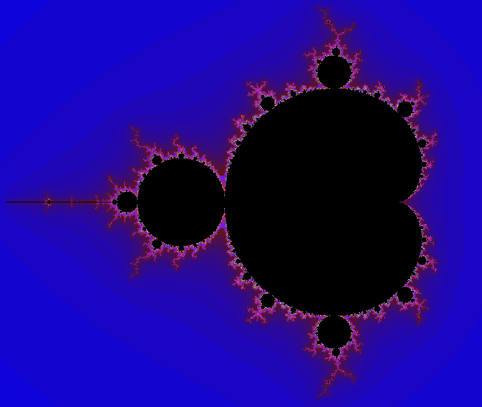
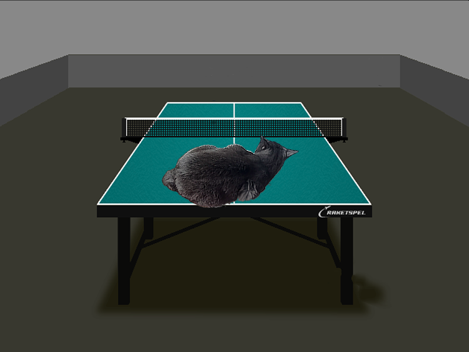

# Отчёт по работе SIMD

## Цель работы

Освоение методов оптимизации с помощью процессорных SIMD инструкций.

## Введение
`SIMD` (Single Instruction, Multiple Data - поток одной команды, множественный поток данных) - одна из моделей параллельных вычислений. В архитектурах, поддерживающих её, можно проводить операции с векторными типами за время одной команды. Для этого на машинном уровне существуют расширенные `xmm` регистры. Функции, использующие эту технологию, называются SIMD-инструкциями и часто применяются в оптимизации алгоритмов.

<!--
`SIMD` (Single Instruction, Multiple Data - одиночный поток команд, множественный поток данных) - принцип вычислений, позволяющий обеспечить параллелизм выполнения команд. Архитектуры современных процессоров позволяют выполнять несколько инструкций одновременно, параллельно при помощи специальных расширенных `xmm` регистров. Эти возможности и используются в ходе оптимизации вычислений с помощью SIMD инструкций. В работе используются наборы команд `SSE4` и `AVX2`. Стоит отметить, что эти технологии доступны не на всех процессорах.

Конвейерная обработка команд процессором имеет несколько недостатков, один из них - риск загрузки и использования. Он возникает из-за зависимости следующей команды от результата предыдущей, поэтому процессор условно приостанавливает конвейер, пока не будет выполнена предыдущая инструкция. Чтобы сократить количество таких зависимостей применяется векторная обработка данных (отсюда и название - одна операция, множественный поток данных) с помощью специальных наборов команд (в этой работе представлены `SSE4` и `AVX2`).
-->
## Ход работы

### Часть 1. Множество Мандельброта

#### Теоретическая справка

Мно́жество Мандельбро́та — множество точек на комплексной плоскости, для которых рекуррентное соотношение ``Z(n+1)^2 = Z(n)^2+Z0`` при ``Z0 = 0`` задаёт ограниченную последовательность.

Данный фрактал обычно отображается на комплексной или декартовой плоскости. 
Вот суть вычисления, проводимого для одной точки на плоскости:

1. Запускается цикл, в котором вычисляются координаты числа ```Z(n+1)``` по формулам:
    ``X(n+1) = X(n)^2 - Y(n)^2 + X0``

    ``Y(n+1) = 2*X(n)*Y(n) + Y0``
    
2. Цикл прекращается, если расстояние от точки (X(n), Y(n)) до точки (0, 0) превышает R_max или число итераций превышает N_max.
*Кратко это условие записывается так: (``R(n) = sqrt(X(n)^2 + Y(n)^2) > R_max = 10`` || ``n > N_max = 256``)*
    
3. Результатом вычислений является число `n` - количество итераций до выхода из цикла.

4. Оно конвертируется в цвет, который приобретает точка с координатами (X0, Y0). Снизу приведён код функции ``Color getColor(int n)``. ``sf::Color`` - класс графической библиотеки ``SFML`` для работы с цветами закодированными в RGBA.

```C++
    Color col = Color(0, 0, 0, 0);

    if (n != N_max)
    {
        col = Color(5*n, n, 255 - 12*n, 255);
    }
    
    return col;
```
Подробнее про этот алгоритм можно прочитать тут: 
https://elementy.ru/posters/fractals/Mandelbrot

Вот пример изображения, выдаваемого нашей программой:


<!--
Объявление констант:

```C++
    const int N_max = 256;
    const float EPS = 0.001
    const float R_max = 10.0;
    const float R_max2 = R_max*R_max;

    const int w_width   = 1000;
    const int w_height  = 1000;

    const float x_max =  2.0;
    const float x_min = -2.0;
    const float y_max =  2.0;
    const float y_min = -2.0;

    float dx = (x_max - x_min)/w_width;
    float dy = (y_max - y_min)/w_height;
```
-->

#### Алгоритм вычислений и его оптимизация

Приведём реализацию алгоритма выше на С. Назовём функцию одного расчёта ``singleCalculation()``.

```C++
    int n = 0;
    while (n < N_max && R2 - R_max2 < EPS)          // Проверка условий выхода из цикла - (2)
    {
        float X2  = X*X;
        float Y2  = Y*Y;
        float XY  = X*Y + X*Y; 

        X = X2 - Y2 + X0;                           // Вычисления координат Z(n+1) - (1)
        Y = XY + Y0;

        R2 = X2 + Y2;

        n++;                                        // Увеличение n в каждой итерации цикла - (3)
    }
    volatile int n_res = n;
    return getColor(n);                             // Конвертация n в некоторый цвет - (4) 
```
Заметим, что некоторые компиляторные оптимизации удаляют вычисления, в результате которых получаются неиспользуемые значения. Существует ключевое слово ``volatile``, прописываемое в объявлении переменных. Все вычисления с этими переменными никак не оптимизируются. Нам требуется найти компромиссный вариант, чтобы с одной стороны разрешить компилятору оптимизировать вычисления, а с другой не потерять результаты вычислений.

Решение такое: 
Cоздаём ``volatile`` переменную ``n_res``. После каждого цикла вычислений присваиваем ей значение ``n``.

Теперь оптимизируем данный код, воспользовавшись набором команд ```SSE4``` из библиотеки ```<xmmintrin.h>```. Стоит заметить, что не каждый процессор поддерживает этот набор команд.

Большинство ``_mm_`` функций, представленных тут, используют векторный тип данных ``__m128``. Он представляет собой 4 float-а по 32-бита. За одну итерацию цикла вычисляется в 4 раза больше значений ``n`` и интуитивно кажется, что алгоритм должен ускорится как минимум в 4х.

```C++
        __m128 n   = _mm_setzero_ps();
        __m128 cmp = _mm_set1_ps(1);

        for(int i = 0; i < N_max; i++)                   // Проверка условий выхода из цикла - (2)
        {
            __m128 X2 = _mm_mul_ps(X, X);
            __m128 Y2 = _mm_mul_ps(Y, Y);
            __m128 R2 = _mm_add_ps(X2, Y2);

            cmp = _mm_cmplt_ps (R2, R2_max);

            int mask  =_mm_movemask_ps (cmp);                                

            if (!mask)
                break;

            __m128 XY = _mm_mul_ps(X, Y); 
            XY = _mm_add_ps (XY, XY);

            X = _mm_sub_ps (X2, Y2);                    // Вычисления координат Z(n+1) - (1)
            X = _mm_add_ps (X, X0);
            Y = _mm_add_ps (XY, Y0);

            cmp = _mm_and_ps(cmp, Mask);

            n = _mm_add_ps(n, cmp);                     // Увеличение n в каждой итерации цикла - (3)

        } ;

        volatile __m128 n_res = n;
        return getColor(n);                             // Конвертация n в некоторый цвет - (4) 
```

#### Алгоритм прохода по пикселям

Алгоритм прохода по пикселям без SSE-оптимизаций.

```C++
   int yi = 0;
   for (; yi < w_height; yi++)                          // Обход по строчкам
    {
        float Y0 = y_min + (Y_shift+yi)*dy*scale;

        int xi = 0;
        for(; xi < w_width; xi++)                       // Обход по столбцам
        {
            float X0 = x_min + (X_shift + xi)*dx*scale;

            float X  = X0;
            float Y  = Y0; 

            float R2 = X*X + Y*Y;

            col = singleCalculation();
            depictPixel(X0, Y0, col);                   // отображение пикселя на экране
        }
    }
```
Алгоритм прохода по пикселям после применения SSE-оптимизации(шаг по столбцам = 4).

```C++
    int N_BYTES = 4;
    __m128 R2_max = _mm_set1_ps(R_max2);
    __m128 Mask   = _mm_set1_ps(0x0001);

    int yi = 0;
    for (; yi < w_height; yi++)                         // Обход по строчкам
    {
        __m128 Y_SHIFT = _mm_set1_ps(y_min + Y_shift*dy*scale);
        __m128 DY = _mm_set1_ps(dy*scale);
        __m128 Y0 = _mm_set1_ps(yi);
        Y0 = _mm_mul_ps(Y0, DY);
        Y0 = _mm_add_ps(Y0, Y_SHIFT);

        int xi = 0;
        for(; xi < w_width; xi+=N_BYTES)                // Обход по столбцам
        {
            __m128 X_SHIFT = _mm_set1_ps(x_min + X_shift*dx*scale);
            __m128 DX = _mm_set1_ps(dx*scale);
            __m128 X0 = _mm_set_ps(xi, xi+1, xi+2, xi+3);

            X0 = _mm_mul_ps(X0, DX);
            X0 = _mm_add_ps(X0, X_SHIFT);

            __m128 X = X0;
            __m128 Y = Y0; 

            col = singleCalculation();
            depictPixel(X0, Y0, col);                   // отображение пикселя на экране
      }
  }     
```

#### Погрешности измерений

Напрямую измерим *iteration time* с помощью ```sf::Clock. Погрешность измерения времени тут составляет в 1 милисекунду.
 А на основе этого вычислим *FPS* по формуле: *FPS* = 1/*iteration time*. Т.к. величина ``iteration time << 0``, то FPS будет более репрезентативна.

Чтобы избавиться от временной задержки, возникающей при вызове функции ```GetFPS()```, сделаем её inline-функцией.

В грубом приближении справедлива эта формула:

```iteration time = number_of_pixels*(calculation_time + drawing_time)```

Оптимизируемой величиной в данной работе является скорость ***вычисления** множества Мандельброта, поэтому отображение, скорость которого невозможно оптимизировать, целесообразно отключить. Чтобы сравнить скорость отрисовки со скоростью вычислений, всё же запустим программу с отображением и без неё.

Назовём *1-м режимом - вычисления с отображением*, a **2-м режимом - вычисления без отображением**.

#### Измерения
  
В таблице снизу приведены значения *FPS* при разных настройках запуска. Также для каждого посчитан коэффициент ускорения относительно первой ячейки этой строки, т.е запуска без флагов. 

|   **Режимы запуска**  | **Без флагов**  |     **-O2**     |     **-O3**     |     **-Ofast**    |
| :---------------: | :----------:| :---------: | :---------: | :----------:  |
|    *1* + no_sse     |   1.43 (1x) | 1.81 (1.3x) | 1.77 (1.2x) |  1.65  (1.2x) |
|    **2** + no_sse     |  6.15 (1x) | 11.1 (1.8x) | 11.2 (1.8x) |  11.6  (1.9x) |
|    **2** + sse        |   8.62 (1x) | 39.6 (4,6x) | 40.3 (4.7x) | 42.6 (4.9x) |
|  **Коэфф. ускорения** |    **1.40**  | **3.57** | **3.60** | **3.67** |

Сравнивая первые две строки таблицы, мы можем заключить, что:
+ 2-й режим плохо ускоряется даже компиляторными флагами оптимизации. 
+ Время рисования примерно в **5** раз больше времени расчётов.

*Как и говорилось ранее запуск программы в 1-м режиме(с отрисовкой) бессмысленен. Также потому, что ускорение в 1-м режиме(с отрисовкой) с помощью SSE не будет заметно.*

Максимальные коэффициенты ускорения с помощью -O флагов в каждой строке следующие:
+ K_o(2+no_sse) = **1.9**
+ K_o(2+sse) = **4.9**

Сравнивая 2-ю и 3-ю строчки получим коэффициенты ускорения программы с помощью SSE-оптимизаций.
Максимальное значение было достигнуто с включённым флагом **-Оfast** и составило 42.6/11.6 = **3.67**.

### Часть 2. Alpha Blending

#### Теоретическая справка

Альфа-смешение - это процесс комбинирования одного изображения с фоном для создания видимости частичной или полной прозрачности.

#### Данные

Изображения фона и накладываемого изображения выберем следующие:

Для фона - теннисный стол.


Для накладываемого изображения - котика.


Также подоберём относительный сдвиг по X и Y такой, чтобы получилось такое взаимное расположение:



#### Простейший алгоритм

<!--
Суть алгоритма такова: цвет каждого пикселя задаём по следующему правилу:
Мы обходим координаты фонового изображения и там, где на него накладывается изображение
!!Написать как я пробегаюсь по изображению и сравниваб

*Ещё одним неочевидным ускорением алгоритма является выравнивание размера накладываемого изображение под размер фона. Тогда можно было бы убрать ```if```, связанный с проверкой на наличие той или иной картинки в данной области.*

```
    int delta_x = xi - x_shift;
    int delta_y = yi - y_shift;
    size_t back_counter = yi*back->width + xi;
    if ( (0 <= delta_x && delta_x < front->width) && (0 <= delta_y && delta_y < front->height))
    {
        result->->pixels[back_counter] = alpha_blend(front->pixels[front_counter], back->pixels[back_counter]);
    } else
    {
        result->pixels[back_counter] = back->pixels[back_counter];
    }
Ниже приведена формула, по которой вычисляется результирущий цвет пикселя.
``` -->
Суть алгоритма такова цвет каждого пикселя задаём по следующему правилу:

~~~C++
result_pixel.color = (front_pixel.alpha*front_pixel.color + (255 - front_pixel.alpha)*back_pixel.color)/255;
~~~

#### Оптимизированный алгоритм

В этом эксперименте, как и в предыдущем, мы применяли SIMD-инструкции. Для более подробного разбора векторного алгоритма можете обратиться к работе моего коллеги: https://github.com/VladZg/Alpha-Blending

Тут приведу реализацию этого алгоритма на ``SSE`` интринсиках.
```
   const __m128i _0 = _mm_set1_epi8(0);
   const __m128i _255  = _mm_set1_epi16(255);

    int step = N_BYTES-1;
    if (front->width-delta_x<N_BYTES)
    {
        step = front->width-delta_x - 1;
    }

    size_t front_counter = (delta_y*front->width + delta_x);

    __m128i front_pixel = _mm_loadu_si128((__m128i const *)(&front->pixels[front_counter]));
    __m128i back_pixel  = _mm_loadu_si128((__m128i const *)(&back->pixels[back_counter]));

    __m128i FRONT_PIXEL = (__m128i) _mm_movehl_ps((__m128) _0, (__m128) front_pixel);
    __m128i BACK_PIXEL = (__m128i) _mm_movehl_ps((__m128) _0, (__m128) back_pixel);

    front_pixel = _mm_cvtepu8_epi16 (front_pixel);
    back_pixel = _mm_cvtepu8_epi16 (back_pixel);

    FRONT_PIXEL = _mm_cvtepu8_epi16 (FRONT_PIXEL);
    BACK_PIXEL = _mm_cvtepu8_epi16 (BACK_PIXEL);

const   __m128i alpha_mask = _mm_setr_epi8(6, zero_val, 6, zero_val, 6, zero_val, 6, zero_val, 14, zero_val, 14, zero_val, 14, zero_val,
    14, zero_val);

    __m128i front_alpha = _mm_shuffle_epi8(front_pixel, alpha_mask);                  // front.a(0,1)
    __m128i FRONT_ALPHA = _mm_shuffle_epi8(FRONT_PIXEL, alpha_mask);                  // front.a(2,3)

    front_pixel = _mm_mullo_epi16(front_pixel, front_alpha);
    FRONT_PIXEL = _mm_mullo_epi16(FRONT_PIXEL, FRONT_ALPHA);
    back_pixel = _mm_mullo_epi16(back_pixel, _mm_sub_epi16 (_255, front_alpha));
    BACK_PIXEL = _mm_mullo_epi16(BACK_PIXEL, _mm_sub_epi16 (_255, FRONT_ALPHA));

    __m128i sum_low = _mm_add_epi16(front_pixel, back_pixel);
    __m128i sum_high = _mm_add_epi16(FRONT_PIXEL, BACK_PIXEL);

const   __m128i sum_mask = _mm_setr_epi8(1, 3, 5, 7, 9, 11, 13, 15, zero_val, zero_val, zero_val, zero_val, zero_val, 
                                            zero_val, zero_val, zero_val);

    sum_low = _mm_shuffle_epi8(sum_low, sum_mask);
    sum_high = _mm_shuffle_epi8(sum_high, sum_mask);
    volatile __m128i color = (__m128i)_mm_movelh_ps((__m128)sum_low, (__m128)sum_high); 

    _mm_storeu_si128 ((__m128i*) &(result->pixels[back_counter]), color) ;
```

#### Погрешности измерений

Систематическая погрешность в этом эксперименте схожа с предыдущей из-за тех же приёмов измерения времени. Применяется ```sf::Clock```, где время измеряется с погрешностью в 1 милисекунду.

Замедление алгоритма из-за отрисовки тут отсутствует, т.к. процессы формирования изображения и записи его в файл последовательны. Поэтому медленное сохранение в файл не увеличивает погрешность измерения основного алгоритма.

#### Измерения

В каждой ячейке написаны измерянная FPS и в () коэффицент ускорения относительно запуска с -О0.

|  **SSE/NO SSE**  | **-O0**  |     **-O2**     |     **-O3**     |     **-Ofast**    |
| :-------------: | :----------:| :---------: | :---------: | :----------:  |
|    **NO SSE**     |  **3800** (1x) |  5700 (1.50x) | 5400 (1.42x) | 5100 (1.34x) |
|     **SSE**       |   4400 (1x) |  14600 (3.3x) | 13400 (3x) | 13400(3x) |
|  **Коэфф. ускорения** |    **1.16**  | **2.56** | **2.5** | **2.6** |

На основе данной таблицы можно сделать следующие выводы:
+ Без флагов оптимизации ускорее SSE незаметно -  **1.16** 
+ **-Ofast** не всегда является самым быстрым флагом оптимизации, тут его выигрывает **-O2**
+ Ускорение SSE сопоставимо с ускорением флагами оптимизации (2-3 раза)
+ Все значения FPS округлены до сотых, так что тут разумнее было бы измерять время напрямую, т.е. *iteration_time*

Максимальные коэффициенты ускорения с помощью -O флагов в каждой строке следующие:
+ K_o(NO SSE) = **1.5** - O2
+ K_o(SSE) = **3.3**    - O2

Сравнивая 2-ю и 3-ю строчки получим коэффициенты ускорения программы с помощью SSE-оптимизаций.
Максимальное значение было достигнуто с включённым флагом **-Оfast** и составило 13400/5100 = **2.6**.

#### Результаты


## Выводы

Основная задача проекта была выполнена. Мы научились снижать систематическую погрешность измерения времени работы алгоритма и оптимизировать его с помощью SIMD-инструкций.

Однако результат использования ```SSE4``` тоже велик: в 1-м и 2-м экспериментах удалось ускорить алгоритм в **2.5-4** раза. Отсюда следует, что параллелизм значительно повышает производительность. 

## Источники и литература

1. Устройство технологии SIMD:
  - http://ftp.cvut.cz/kernel/people/geoff/cell/ps3-linux-docs/CellProgrammingTutorial/BasicsOfSIMDProgramming.html

2. Классы sf::Clock и графика взяты из библиотеки SFML:
  - https://www.sfml-dev.org/

3. Источник SIMD-инструкций для процессоров intel:
  - https://www.laruence.com/sse

----------------

<!-- Т.к. одного вычисления одного цвета это ```calculation_time```, а измерять мы можем без замедления самих вычислений только ```iteration time```. Поэтому для снижения погрешности можно увеличить вес вычислений в ```k = 1000``` раз. Тогда 
```iteration time/k = number_of_pixels*(calculation_time*k + drawing_time) ≈ number_of_pixels*calculation_time``` -->
